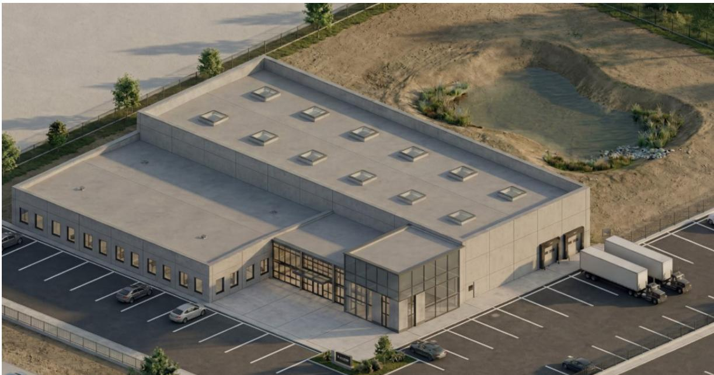
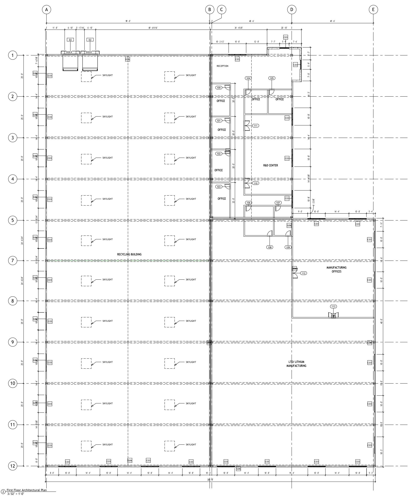
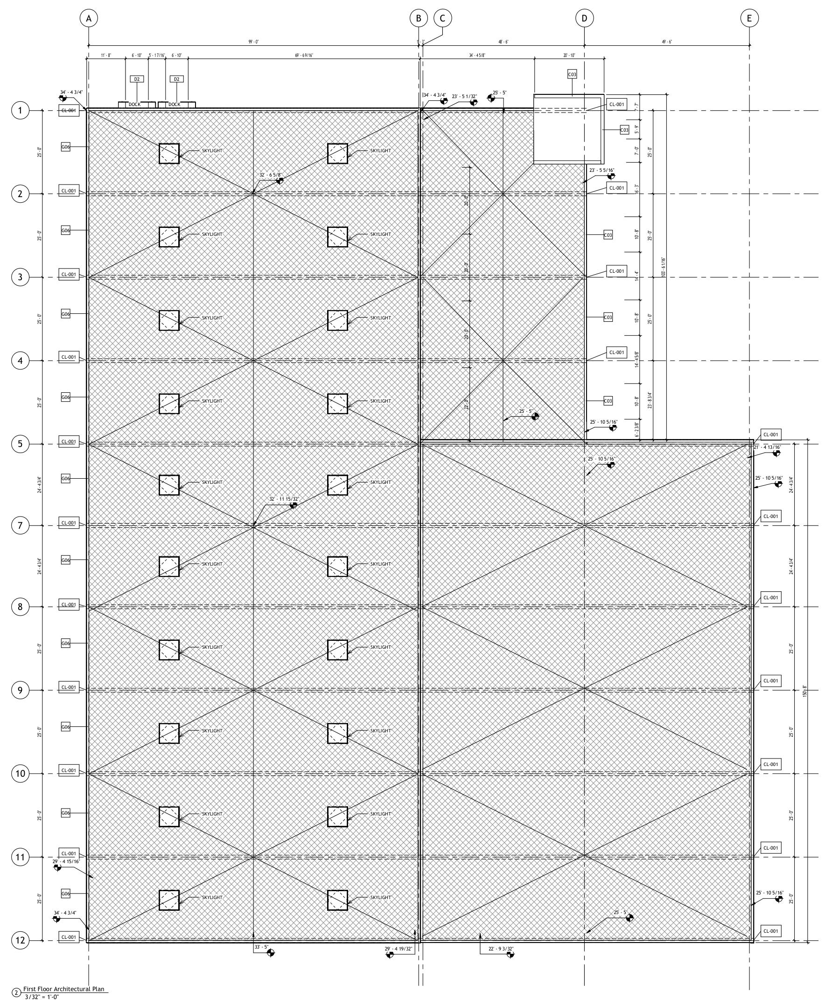
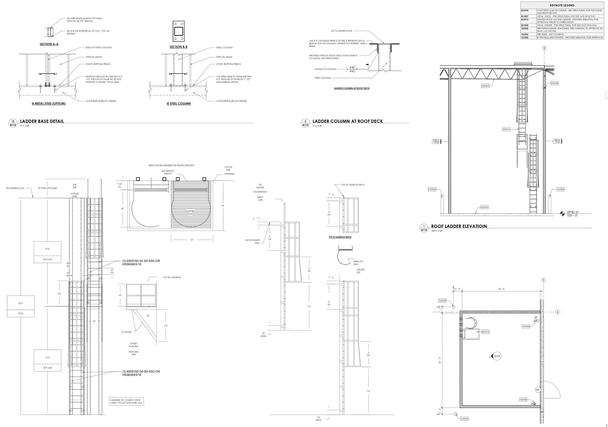

## ARCHITECT & STRUCTURAL ENGINEER

ae urbia ARCHITECTS & ENGINEERS

909 W SOUTH JORDAN PKWY SOUTH JORDAN-UT 84095

www.asurbia.com 801.746.0455

## GENERAL CONTRACTOR

## MECHANICAL ENGINEER

4704 CRESTMOOR CT.

WEST JORDAN, UTAH 84088

OFFICE 801.330.1472

FAX 801.999.4341

## ELECTRICAL ENGINEER

## AMP Engineering ELECTRICAL ENGINEERS

Electrical Engineering, 112

100000

## CIVIL ENGINEER

## CIVILE MONEE EXING + SURVEYING

10718 S. BECKSTEAD LANE, STE. 102 SOUTH JORDAN, UT 84095

## LANDSCAPE ARCHITECT

3450 N. TRIUMPH BLVD SUITE 102

LEHI, UT 84043

OFFICE 801.960.2698

## CONTRACTOR COORDINATION NOTES

1. IT IS THE CONTRACTOR'S RESPONSIBILITY TO REVIEW AND COORDINATE THE WORK OF ALL SUB CONTRACTORS. TRADES AND SUPPLIERS WITH THE REQUIREMENTS OF THE CONTRACT DOCUMENTS.

BEFORE COMMENCING CONSTRUCTION, AND TO ASSURE THAT ALL PARTIES ARE AWARE OF ALL REQUIREMENTS, REGARDLESS OF WHERE THE REQUIREMENTS OCCUR IN THE CONTRACT DOCUMENTS, WHICH MIGHT AFFECT THE WORK OF THAT PARTY AND THAT THE MOST UP TO DATE DOCUMENTS ARE BEING REFERENCED.

2. AS PART OF THE CONTRACTORS RESPONSIBILITY TO COORDINATE THE WORKOF ALL SUB CONTRACTORS, TRADES AND SUPPLIERS, THE CONTRACTOR SHALL ENDEAVORTO IDENTIFY AND NOTIFY THE ARCHITECT OF ANY CONFLICTS BETWEEN THE WORK OF DIFFERENT PARTIES AT THE EARLIEST POSSIBLE DATE SO AS TO ALLOW REASONABLE AND ADEQUATE TIME FOR THE CONFLICT TO BE RESOLVED WITHOUT DELAYING THE WORK. ALL DEVIATIONS FROM THAT WHICH IS REQUIRED

BY THE CONTRACT DOCUMENTS MUST BE REVIEWED IN ADVANCE BY THE ARCHITECT.

3. THE CONTRACTOR SHALL NOTIFY THE OWNER REPRESENTATIVE OF ANY CONFLICTS BETWEEN VENDOR DRAWINGS AND THE CONSTRUCTION DOCUMENTS. LATEST VENDOR DRAWINGS SHALL BE VERIFIED WITH OWNER AND ARCHITECT.

4. IN THE CASE OF CONFLICTS IN THE CONTRACT DOCUMENTS THE MOST STRINGENT REQUIREMENT GOVERNS

## DEFERRED SUBMITTAL REQUIREMENTS

DEFERRED SUBMITTALS ARE THOSE PORTIONS OF DESIGN THAT ARE NOT SUBMITTED AT THE TIME OF THE

PERMIT APPLICATION AND HAVE RECEIVED PRIOR APPROVAL FROM THE BUILDING OFFICIAL TO BE DEFERRED, THE DEFERRED SUBMITTALS SHALL BE SUBMITTED TO THE ARCHITECT AND GENERAL CONTRACTOR WITHIN SIX WEEKS TO COMMENCEMENT OF CONSTRUCTION TO THIS PORTION OF WORK.

DEFERRED SUBMITTALS SHALL BE SUBMITTED TO THE ARCHITECT AND GENERAL CONTRACTOR WITHIN FOUR

WEEKS OF THE AWARD OF THE CONTRACT TO THE GENERAL CONTRACTOR. THIS PROCESS MAY VARY. RUT

SHOULD ALLOW FOR POSSIBLE 4-6 WEEK REVIEW PROCESS. CONTRACTOR IS RESPONSIBLE TO COORDINATE FOR REVIEW TIMES IN CRITICAL PATH OF CONSTRUCTION.

## DEFERRED SUBMITTAL PROCESS

1. THE DEFERRED SUBMITTAL SHALL FIRST BE REVIEWED BY THE GENERAL CONTRACTOR FOR COMPLIANCE WITH THE CONSTRUCTION DOCUMENTS. THE SUBMITTAL MUST BE REVIEWED, APPROVED, STAMPED AND SIGNED BY THE GENERAL CONTRACTOR BEFORE BEING SUBMITTED TO THE ARCHITECT.

2. THE GENERAL CONTRACTOR SHALL SUBMIT THE DEFERRED SUBMITTAL TO THE ARCHITECT.

3. THE DEFERRED SUBMITTAL ITEMS WILL BE REVIEWED BY THE ENGINEER OR ARCHITECT IN RESPONSIBLE CHARGE. THE ENGINEER OR ARCHITECT WILL ATTACH A LETTER TO THE SUBMITTAL STATING THAT THE DEFERRED ITEM IS IN CONFORMANCE WITH THE DESIGN OF THE STRUCTURE.

4. THE APPROVED SUBMITTALS WILL BE RETURNED TO THE GENERAL CONTRACTOR. THE CONTRACTOR SHALL BE RESPONSIBLE FOR CITY SUBMITTAL AND ALL APPROVALS REQUIRED BY THE CITY.

5. THE GENERAL CONTRACTOR SHALL MAINTAIN ONE SET OF THE APPROVED SUBMITTAL ON SITE FOR REFERENCE BY THE CITY INSPECTOR.

6. THE DEFERRED SUBMITTAL, ITEMS SHALL NOT BE INSTALLED UNTIL SUBMITTAL DOCUMENTS HAVE BEEN APPROVED BY BUILDING OFFICIAL. ALL WORK COMPLETED PRIOR TO APPROVAL AND REQUIRES CHANGE OR MODIFICATION DUE TO APPROVALS IS THE SOLE RESPONSIBILITY OF THE CONTRACTOR.

7. SEE STRUCTURAL NOTES FOR ADDITIONAL REQUIREMENTS FOR STRUCTURAL DEFERRED SURMITTALS.

8. COORDINATE WITH GENERAL NOTES OF STRUCTURAL, MECHANICAL, AND ELECTRICAL FOR ADDITIONAL INSTRUCTIONS.

## DEFERRED SUBMITTAL ITEMS

1. FIRE SPRINKLING DRAWINGS: FIRE SPRINKLER SYSTEM TO BE DESIGNED IN ACCORDANCE WITH NIFPA 13 (ESFR) FOR RACK STORAGE OF CLASS ONE (1) THROUGH FOUR (4) COMMODITIES AND VARIOUS GROUP "A" PLASTICS. THESE DRAWINGS SHALL INCLUDE THE DESIGN CALCULATIONS, DESIGN DRAWINGS, APPROVAL FROM THE FIRE MARSHALL PRIOR TO SUBMITTING TO THE DESIGN TEAM FOR FINAL ACCEPTANCE. FIRE SPRINKLER CONTRACTOR/DESIGN MUST VERIFY W/ LOCAL FIRE AUTHORITY. ALL FIRE SPRINKLERS HEADS TO BE PLACED AS CLOSE AS POSSIBLE TO DECKS. NO REVIEW WILL BE PERFORMED IF THE SUBMITTAL IS NOT COMPLETE. THE CONTRACTOR WILL ALSO BE RESPONSIBLE FOR ANY THIRD PARTY REVIEW COSTS REQUIRED BY LOCAL JURISDICTIONS FIRE AUTHORITY.

2. FIRE ALARM DESIGN. THE FIRE ALARM DEVICES SHOWN ON THE DRAWINGS ARE DIAGRAMATIC, IT IS THE RESPONSIBILITY OF THE FIRE ALARM CONTRACTOR TO PROVIDE A SYSTEM THAT MEETS THE FULL INTENT OF NFPA 72. THE SUB CONTRACTOR WILL BE RESPONSIBLE TO TEST TO VERIFY THE REQUIREMENTS OF NFPA 72 ARE BEING MET. IF ADDITIONAL FIRE ALARM DEVICES ARE REQUIRED, THE DEVICES WILL BE THE REQUIREMENTS OF THE FIRE ALARM CONTRACTOR TO PROVIDE A COMPLETE SYSTEM TO MEET NFPA 72.

## BUILDING CODES

ALL CONSTRUCTION IN ASSOCIATION WITH THIS PROJECT SHALL COMPLY WITH THE STATE ADOPTED CODES

LISTED BELOW:

- 2021 EDITION OF THE INTERNATIONAL BUILDING CODE (IBC), INCLUDING APPENDIX C AND J

- 2020 EDITION OF THE NATIONAL ELECTRICAL CODE (NEC)

- 2021 EDITION OF THE INTERNATIONAL PLUMBING CODE (IPC)

- 2021 EDITION OF THE INTERNATIONAL MECHANICAL CODE (IMC)

- 2021 EDITION OF THE INTERNATIONAL ENERGY CONSERVATION CODE (IECC)

- 2021 EDITION OF THE INTERNATIONAL FUEL GAS CODE (IFGC)

- 2021 INTERNATIONAL FIRE CODE (IFC)

- ICC/ANSI A117.1-2009

- UTAH STATE AMENDMENTS TO THE ABOVE MENTIONED CODES.

## NOTE:

THE CONTRACTOR IS TO CONTACT THE UTAH DIVISION OF AIR QUALITY, (801) 536-4000. COMPLIANCE WITH THEIR REQUIREMENTS IS MANDATORY.

## NOTE:

Fire suppression, detection and site utility drawings for fire protection, are deferred submittals and require a separate building permit. These drawings are not approved as part of this submitted package. (Deferred submittals require a signed agreement with Idaho Falls; registered design professional, and the building owner, and/or tenant.

Any Building Fire Sprinkler System Work (IFC [A] 105.7.1).

Any Building Fire Alarm System Work (IFC [A] 105.7.6).

All deferred (IBC 107.3.4.1) submittal item(s) need to be submitted within a timely manner (30 calendar days of the original building permit issuance date). The final inspection approval (IBC 110.3.10) cannot be issued and no building or structure can be used or occupied (IBC 111.1) until all the deferred submitted items are approved by the building official.

## FIRE DEPARTMENT CONNECTION & EMERGENCY RESPONDER RADIO COVERAGE NOTES:

A. THE BUILDING SHALL BE CONSIDERED TO HAVE ACCEPTABLE EMERGENCY RESPONDER RADIO COVERAGE WHEN SIGNAL STRENGTH MEASUREMENTS IN 56 PERCENT OF ALL AREAS ON EACH FLOOR OF THE BUILDING MEET THE SIGNAL STRENGTH REQUIREMENTS OF SECTIONS 510.4.1.1 AND 510.4.1.2 OF THE INTERNATIONAL FIRE CODE.

B. A VALID FCC-ISSUED GENERAL RADIO OPERATOR'S LICENSE AND CERTIFICATION OF IN-BUILDING SYSTEM TRAINING ISSUED BY A NATIONALLY RECOGNIZED ORGANIZATION SCHOOL OR A CERTIFICATE ISSUED BY THE MANUFACTURER OF THE EQUIPMENT BEING INSTALLED. THE EMERGENCY RESPONDER RADIO COVERAGE SYSTEM INSTALLATION AND COMPONENTS SHALL ALSO COMPLY WITH ALL APPLICABLE FEDERAL REGULATIONS INCLUDING, BUT NOT LIMITED TO, FCC 47 CFR PART 90.219.

C. PROVIDE AN ADDRESS ON THE BUILDING WHICH IS ASSIGNED BY THE CITY ENGINEERING DEPARTMENT. IF THE SPACE IS SUBDIVITED THEN THE UNIT NUMBER OR LETTER SHALL BE PLACED ON OR NEAR THE ENTRANCE OF THE UNIT. THESE NUMBERS AND LETTERS SHALL BE VISIBLE FROM THE STREET AND BE A MINIMUM 6 INCHES HIGH AND A STROKE OF 1 INCH. ADDRESS NUMBERS SHALL BE ARABIC NUMBERS OR ALPHABETICAL LETTERS. THIS ADDRESS SHALL BE CONTRASTING COLOR OF THE BACKGROUND.

D. IN ACCORDANCE WITH IFC SECTION 510 BUILDINGS SHALL HAVE APPROVED RADIO COVERAGE FOR EMERGENCY RESPONDERS WITHIN THE BUILDING BASED UPON THE EXISTING COVERAGE LEVELS OF THE PUBLIC SAFETY COMMUNICATION SYSTEMS OF THE JURISDICTION AT THE EXTERIOR OF THE BUILDING. THIS SECTION SHALL NOT REQUIRE IMPROVEMENT OF THE EXISTING PUBLIC SAFETY COMMUNICATION SYSTEMS. THE BUILDING SHALL BE CONSIDERED TO HAVE ACCEPTABLE EMERGENCY RESPONDER RADIO COVERAGE WHEN SIGNAL STRENGTH MEASUREMENTS IN 95 PERCENT OF ALL AREAS ON EACH FLOOR OF THE BUILDING MEET THE SIGNAL STRENGTH REQUIREMENTS OF SECTIONS 510.4.1.1 AND 510.4.1.2 OF THE INTERNATIONAL FIRE CODE.

E. EMERGENCY RESPONDER RADIO SYSTEM COVERAGE SHALL BE DESIGNED IN ACCORDANCE WITH IFC SECTION 510. A SEPARATE FIRE PERMIT IS REQUIRED AS SPECIFIED INFCC SECTION 105.7.5 (SALT LAKE CITY RADIO SYSTEM DESIGN IS BOTH AN 800 MHz ANALOG TRUNKING SYSTEM AND A MIXED ANALOG P25 DIGITAL SYSTEM ON 800 MHz. THE MINIMUM QUALIFICATIONS OF THE SYSTEM DESIGNER AND LEAD INSTALLATION PERSONNEL SHALL INCLUDE: A VALID FCC-ISSUED GENERAL RADIO OPERATOR'S LICENSE, AND CERTIFICATION OF IN-BUILDING SYSTEM TRAINING ISSUED BY A NATIONALLY RECOGNIZED ORGANIZATION. SCHOOL OR A CERTIFICATE ISSUED BY THE MANUFACTURER OF THE EQUIPMENT BEING INSTALLED. THE EMERGENCY RESPONDER RADIO COVERAGE SYSTEM INSTALLATION AND COMPONENTS SHALL ALSO COMPLY WITH ALL APPLICABLE FEDERAL REGULATIONS INCLUDING, BUT NOT LIMITED TO, FCC 47 CFR PART 90.219.

## FIRE NOTES:

AND STANDPIPE) SHALL BE CONSTRUCED WITH THE FOLLOWING CLEARANCES:

A. A MINIMUM OF 12 INCHES THAT IS UNOBSTRUCTED FROM ALL WALLS (INTERIOR AND EXTERIOR) TO INCLUDE MULTIPLE RISERS WHICH ARE SUPPLIED BY ONE OR MORE.

B. A MINIMUM OF 36 INCHES SHALL BE PROVIDED IN FRONT OF THE APPLIANCES LISTED ABOVE.

C. PUMP ROOMS SHALL BE PROVIDED WITH A CLEAR AND UNOBSTRUCTED PASSAGEWAY TO THE RISER ROOM OF NOT LESS THAN 72 INCHES AND THE OPENING INTO THE ROOM SHALL BE CLEAR AND UNOBSTRUCTED AND LARGE EXHANGER ALLOW FOR THE RISER ROOM OF THE LARGEST PISCE OF EQUIPMENT. WITH DOORS SWINGING IN THE OUTWARD DIRECTION FROM THE ROOM AND THE OPENING PROVIDING A CLEAR WIDTH OF NOT LESS THAN 68 INCHES AND A CLEAR HEIGHT OF THE DOOR OPENING SHALL NOT BE LESS THAN 80 INCHES.

2. FIRE ALARM SYSTEM SHALL BE INSTALLED WHEN THERE ARE EXTINGUISHING.

3. AUDIBLE ALARM NOTIFICATION APPLICATIONS SHALL PROVIDE A SOUND PRESSURE LEVEL OF 15 DECIBLES (dBA) ABOVE THE AVERAGE AMBIENT SOUND ALARM.

4. DURATION OF AT LEAST 60 SECONDS, WHichever IS GREATER, IN EVERY OCCUPIED SPACE WITHIN THE BUILDING.

5. THE MAXIMUM SOUND PRESSURE LEVEL FOR AUDIBLE ALARM NOTIFICATION APPLIANCES SHALL BE 110 dBA AT THE MINIMUM HEARING DISTANCE FROM THE AVERAGE ALARM.

6. A BABY ALARM NOTIFICATION APPLICATIONS SHALL BE PROVIDED THAN 95 dBA. VISIBLE ALARM NOTIFICATION APPLIANCES SHALL BE PROVIDED IN ACCORDANCE WITH NFPA 72 AND AUDIBLE ALARM NOTIFICATION APPLIANCES SHALL NOT BE REQUIRED.

7. FIRE ALARM SYSTEM HORN AND STROBE SHALL BE INSTALLED UNLESS WITHIN THE AREA APPLIANCES ARE INSTALLED AND THE AREA HAS THE REQUIRED dB RATING AS PER THE ALARM.

8. A MINIMUM OF 32 INCHES SHALL BE PROVIDED IN FRONT OF THE ALARMS.

6. POWER PANELS WHICH SUPPLY POWER TO FIRE ALARM SYSTEMS SHALL HAVE BRANCH CIRCUITS IDENTIFIED BY RED LABELS STATING "FIRE ALARM CIRCUIT" THIS REQUIREMENT MAY BE FOUND IN NATIONAL ELECTRICAL CODE ARTICLE 760.41B.

7. WATER LATERALS THAT SUPPLY WATER BASED FIRE PROTECTION SHALL BE FERROUS PIPE WHEN IT PASSES THROUGH A FOUNDATION WALL OR UNDER FOOTING AND FOUNDATION WALLS.

<table><tr><td>1</td><td>2</td><td>3</td><td>4</td><td>5</td><td>6</td><td>7</td><td>8</td><td>9</td><td>10</td><td>11</td><td>12</td></tr><tr><td>1</td><td>1</td><td>2</td><td>3</td><td>4</td><td>5</td><td>6</td><td>7</td><td>8</td><td>9</td><td>10</td><td>11</td></tr><tr><td>1</td><td>1</td><td>2</td><td>3</td><td>4</td><td>5</td><td>6</td><td>7</td><td>8</td><td>9</td><td>10</td><td>11</td></tr><tr><td>1</td><td>1</td><td>2</td><td>3</td><td>4</td><td></td><td></td><td></td><td></td><td></td><td></td><td></td></tr></table>

## GENERAL NOTES

1. ALL DIMENSIONS ARE TO FACE OF-STUD UNDLESS NOTED.

2. OUTSIDE FACE OF WALL, REFER TO DETAILS FOR CLARIFICATION.

3. SEE SHEET GOO FOR PROJECT GENERAL, NOTES REVIEW ALL NOTES.

4. SEE SHEET GOO FOR PROJECT GENERAL, NOTUES REVIEW ALL COLORS.

5. SEE SHEET GOO FOR PROJECT GENERAL, NOTUES REVIEW ALL MATERIALS.

6. INSTALL ALL MATERIALS PER MANUFACTURERS.

RECOMMENDATION FOR THE TAPED, SANDED, AND PRIMED.

7. SEE STRUCTURAL DRAWINGS AND CALCULATIONS FOR ALL.

8. STRUCTURAL REQUIREMENTS.

9. SEE COMPUTER-REVIEW, PRINCIPLES FOR LOCATIONS OF COLUMNS, BEAM, ETC.

10. SEE COMPUTER-REVIEW, PRINCIPLES FOR LOCATIONS OF ELEVATIONS AND SCHEDULES.

11. COORDINATE WITH ELECTRICAL FOR ALL LIGHTING, POWER, & ELECTRICAL.

12. FINE RATED ASSEMBLES SHALL BE CONTINUOUS BOTH ASSEMBLY AND ELECTRICAL.

13. SEE INVESTIGATIONS, SENSING, AND MEASURING RATED ASSEMBLY TO RATED ASSEMBLY.

14. FIRE EXTINGUISERS, SMOKE DETECTORS, OTHER EMERGENCY DRAWINGS, AND ELECTRICAL DRAWINGS.

15. SEE MINute, PRIOR TO INSTALLATION, BE APPROVED BY FIRE MINUTE, PRIOR TO INSTALLATION, AND BE APPROVED THROUGHOUT THE PROJECT AS REQUIRED TO ACCOMMODATE WALL-MOUNTED FURNISHINGS, ARTWORK, ETC.

16. SEE INVESTIGATIONS, SENSING, AND MEASURING RATED ASSEMBLY TO A FURNISHING, WORK, & ELECTRICAL DRAWINGS.

17. SEE INVESTIGATIONS, SENSING, AND MEASURING RATED ASSEMBLY TO ALL KEYNOTED ITEMS FOR APPROVAL FROM WELL-ARCHITECT, INVESTIGATIONS, SENSING, AND MEASURING RATED ASSEMBLY TO ALL MEASURING THROUGHOUT THE PROJECT AS REQUIRED TO ACCOMPODATE WALL-MOUNTED FURNISHINGS, ARTWORK, ETC.

18. SEE INVESTIGATIONS, SENSING, AND MEASURING RATED ASSEMBLY TO ALL MEASURING THROUGHOUT THE PROJECT AS REQUIRED TO ACCOMPODATE MEASURING THROUGHOUT THE PROJECT AS REQUIRED TO ACCOMPODATE MEASURING THROUGHOUT THE PROJECT AS REQUIRED TO ACCOMPODATE MEASURING THROUGHOUT THE PROJECT AS REQUIRED TO ACCOMPODATE MEASURING THROUGHOUT THE PROJECT AS REQUIRED TO ACCOMPODATE MEASURING THROUGHOUT THE PROJECT AS REQUIRED TO ACCOMPODATE MEASURING THROUGHOUT THE PROJECT AS REQUIRED TO ACCOMPODATE MEASURING THROUGHOUT THE PROJECT AS REQUIRED TO ACCOMPODATE MEASURING THROUGHOUT THE PROJECT AS REQUIRED TO ACCOMPODATE MEASURING THROUGHOUT THE PROJECT AS REQUIRED TO ACCOMPODATE MEASURING THROUGHOUT THE PROJECT AS REQUIRED TO ACCOMPODATE MEASURING THROUGHOUT THE PROJECT AS REQUIRED TO ACCOMPODATE MEASURING THROUGHOUT THE PROJECT AS REQUIRED TO ACCOMPODATE MEASURING THROUGHOUT THE PROJECT AS REQUIRED TO ACCOMPODATE MEASURING THROUGHOUT THE PROJECT AS REQUIRED TO ACCOMPODATE MEASURING THROUGHOUT THE PROJECT AS REQUIRED TO ACCOMPODATE MEASURING THROUGHOUT THE PROJECT AS REQUIRED TO ACCOMPODATE MEASURING THROUGHOUT THE PROJECT AS REQUIRED TO ACCOMPODATE MEASURING THROUGHOUT THE PROJECT AS REQUIRED TO ACCOMPODATE MEASURING THROUGHOUT THE PROJECT AS REQUIRED TO ACCOMPODATE MEASURING THROUGHOUT THE PROJECT AS REQUIRED TO ACCOMPODATE MEASURING THROUGHOUT THE PROJECT AS REQUIRED TO ACCOMPODATE MEASURING THROUGHOUT THE PROJECT AS REQUIRED TO ACCOMPODATE MEASURING THROUGHOUT THE PROJECT AS REQUIRED TO ACCOMPODATE MEASURING THROUGHOUT THE PROJECT AS REQUIRED TO ACCOMPODATE MEASURING THROUGHOUT THE PROJECT AS REQUIRED TO ACCOMPODATE MEASURING THROUGHOUT THE PROJECT AS REQUIRED TO ACCOMPODATE MEASURING THROUGHOUT THE PROJECT AS REQUIRED TO ACCOMPODATE MEASURING THROUGHOUT THE PROJECT AS REQUIRED TO ACCOMPODATE MEASURING THROUGHOUT THE PROJECT AS REQUIRED TO ACCOMPODATE MEASURING THROUGHOUT THE PROJECT AS REQUIRED TO ACCOMPODATE MEASURING THROUGHOUT THE PROJECT AS REQUIRED TO ACCOMPODATE MEASURING THROUGHOUT THE PROJECT AS REQUIRED TO ACCOMPODATE MEASURING THROUGHOUT THE PROJECT AS REQUIRED TO ACCOMPODATE MEASURING THROUGHOUT THE PROJECT AS REQUIRED TO ACCOMPODATE MEASURING THROUGHOUT THE PROJECT AS REQUIRED TO ACCOMPODATE MEASURING THROUGHOUT THE PROJECT AS REQUIRED TO ACCOMPODATE MEASURING THROUGHOUT THE PROJECT AS REQUIRED TO ACCOMPODATE MEASURING THROUGHOUT THE PROJECT AS REQUIRED TO ACCOMPODATE MEASURING THROUGHOUT THE PROJECT AS REQUIRED TO ACCOMPODATE MEASURING THROUGHOUT THE PROJECT AS REQUIRED TO ACCOMPODATE MEASURING THROUGHOUT THE PROJECT AS REQUIRED TO ACCOMPODATE MEASURING THROUGHOUT THE PROJECT AS REQUIRED TO ACCOMPODATE MEASURING THROUGHOUT THE PROJECT AS REQUIRED TO ACCOMPODATE MEASURING THROUGHOUT THE PROJECT AS REQUIRED TO ACCOMPODATE MEASURING THROUGHOUT THE PROJECT AS REQUIRED TO ACCOMPODATE MEASURING THROUGHOUT THE PROJECT AS REQUIRED TO ACCOMPODATE MEASURING THROUGHOUT THE PROJECT AS REQUIRED TO ACCOMPODATE MEASURING THROUGHOUT THE PROJECT AS REQUIRED TO ACCOMPODATE MEASURING THROUGHOUT THE PROJECT AS REQUIRED TO ACCOMPODATE MEASURING THROUGHOUT THE PROJECT AS REQUIRED TO ACCOMPODATE MEASURING THROUGHOUT THE PROJECT AS REQUIRED TO ACCOMPODATE MEASURING THROUGHOUT THE PROJECT AS REQUIRED TO ACCOMPODATE MEASURING THROUGHOUT THE PROJECT AS REQUIRED TO ACCOMPODATE MEASURING THROUGHOUT THE PROJECT AS REQUIRED TO ACCOMPODATE MEASURING THROUGHOUT THE PROJECT AS REQUIRED TO ACCOMPODATE MEASURING THROUGHOUT THE PROJECT AS REQUIRED TO ACCOMPODATE MEASURING THROUGHOUT THE PROJECT AS REQUIRED TO ACCOMPODATE MEASURING THROUGHOUT THE PROJECT AS REQUIRED TO ACCOMPODATE MEASURING THROUGHOUT THE PROJECT AS REQUIRED TO ACCOMPODATE MEASURING THROUGHOUT THE PROJECT AS REQUIRED TO ACCOMPODATE MEASURING THROUGHOUT THE PROJECT AS REQUIRED TO ACCOMPODATE MEASURING THROUGHOUT THE PROJECT AS REQUIRED TO ACCOMPODATE MEASURING THROUGHOUT THE PROJECT AS REQUIRED TO ACCOMPODATE MEASURING THROUGHOUT THE PROJECT AS REQUIRED TO ACCOMPODATE MEASURING THROUGHOUT THE PROJECT AS REQUIRED TO ACCOMPODATE MEASURING THROUGHOUT THE PROJECT AS REQUIRED TO ACCOMPODATE MEASURING THROUGHOUT THE PROJECT AS REQUIRED TO ACCOMPODATE MEASURING THROUGHOUT THE PROJECT AS REQUIRED TO ACCOMPODATE MEASURING THROUGHOUT THE PROJECT AS REQUIRED TO ACCOMPODATE MEASURING THROUGHOUT THE PROJECT AS REQUIRED TO ACCOMPODATE MEASURING THROUGHOUT THE PROJECT AS REQUIRED TO ACCOMPODATE MEASURING THROUGHOUT THE PROJECT AS REQUIRED TO ACCOMPODATE MEASURING THROUGHOUT THE PROJECT AS REQUIRED TO ACCOMPODATE MEASURING THROUGHOUT THE PROJECT AS REQUIRED TO ACCOMPODATE MEASURING THROUGHOUT THE PROJECT AS REQUIRED TO ACCOMPODATE MEASURING THROUGHOUT THE PROJECT AS REQUIRED TO ACCOMPODATE MEASURING THROUGHOUT THE PROJECT AS REQUIRED TO ACCOMPODATE MEASURING THROUGHOUT THE PROJECT AS REQUIRED TO ACCOMPODATE MEASURING THROUGHOUT THE PROJECT AS REQUIRED TO ACCOMPODATE MEASURING THROUGHOUT THE PROJECT AS REQUIRED TO ACCOMPODATE MEASURING THROUGHOUT THE PROJECT AS REQUIRED TO ACCOMPODATE MEASURING THROUGHOUT THE PROJECT AS REQUIRED TO ACCOMPODATE MEASURING THROUGHOUT THE PROJECT AS REQUIRED TO ACCOMPODATE MEASURING THROUGHOUT THE PROJECT AS REQUIRED TO ACCOMPODATE MEASURING THROUGHOUT THE PROJECT AS REQUIRED TO ACCOMPODATE MEASURING THROUGHOUT THE PROJECT AS REQUIRED TO ACCOMPODATE MEASURING THROUGHOUT THE PROJECT AS REQUIRED TO ACCOMPODATE MEASURING THROUGHOUT THE PROJECT AS REQUIRED TO ACCOMPODATE MEASURING THROUGHOUT THE PROJECT AS REQUIRED TO ACCOMPODATE MEASURING THROUGHOUT THE PROJECT AS REQUIRED TO ACCOMPODATE MEASURING THROUGHOUT THE PROJECT AS REQUIRED TO ACCOMPODATE MEASURING THROUGHOUT THE PROJECT AS REQUIRED TO ACCOMPODATE MEASURING THROUGHOUT THE PROJECT AS REQUIRED TO ACCOMPODATE MEASURING THROUGHOUT THE PROJECT AS REQUIRED TO ACCOMPODATE MEASURING THROUGHOUT THE PROJECT AS REQUIRED TO ACCOMPODATE MEASURING THROUGHOUT THE PROJECT AS REQUIRED TO ACCOMPODATE MEASURING THROUGHOUT THE PROJECT AS REQUIRED TO ACCOMPODATE MEASURING THROUGHOUT THE PROJECT AS REQUIRED TO ACCOMPODATE MEASURING THROUGHOUT THE PROJECT AS REQUIRED TO ACCOMPODATE MEASURING THROUGHOUT THE PROJECT AS REQUIRED TO ACCOMPODATE MEASURING THROUGHOUT THE PROJECT AS REQUIRED TO ACCOMPODATE MEASURING THROUGHOUT THE PROJECT AS REQUIRED TO ACCOMPODATE MEASURING THROUGHOUT THE PROJECT AS REQUIRED TO ACCOMPODATE MEASURING THROUGHOUT THE PROJECT AS REQUIRED TO ACCOMPODATE MEASURING THROUGHOUT THE PROJECT AS REQUIRED TO ACCOMPODATE MEASURING THROUGHOUT THE PROJECT AS REQUIRED TO ACCOMPODATE MEASURING THROUGHOUT THE PROJECT AS REQUIRED TO ACCOMPODATE MEASURING THROUGHOUT THE PROJECT AS REQUIRED TO ACCOMPODATE MEASURING THROUGHOUT THE PROJECT AS REQUIRED TO ACCOMPODATE MEASURING THROUGHOUT THE PROJECT AS REQUIRED TO ACCOMPODATE MEASURING THROUGHOUT THE PROJECT AS REQUIRED TO ACCOMPODATE MEASURING THROUGHOUT THE PROJECT AS REQUIRED TO ACCOMPODATE MEASURING THROUGHOUT THE PROJECT AS REQUIRED TO ACCOMPODATE MEASURING THROUGHOUT THE PROJECT AS REQUIRED TO ACCOMPODATE MEASURING THROUGHOUT THE PROJECT AS REQUIRED TO ACCOMPODATE MEASURING THROUGHOUT THE PROJECT AS REQUIRED TO ACCOMPODATE MEASURING THROUGHOUT THE PROJECT AS REQUIRED TO ACCOMPODATE MEASURING THROUGHOUT THE PROJECT AS REQUIRED TO ACCOMPODATE MEASURING THROUGHOUT THE PROJECT AS REQUIRED TO ACCOMPODATE MEASURING THROUGHOUT THE PROJECT AS REQUIRED TO ACCOMPODATE MEASURING THROUGHOUT THE PROJECT AS REQUIRED TO ACCOMPODATE MEASURING THROUGHOUT THE PROJECT AS REQUIRED TO ACCOMPODATE MEASURING THROUGHOUT THE PROJECT AS REQUIRED TO ACCOMPODATE MEASURING THROUGHOUT THE PROJECT AS REQUIRED TO ACCOMPODATE MEASURING THROUGHOUT THE PROJECT AS REQUIRED TO ACCOMPODATE MEASURING THROUGHOUT THE PROJECT AS REQUIRED TO ACCOMPODATE MEASURING THROUGHOUT THE PROJECT AS REQUIRED TO ACCOMPODATE MEASURING THROUGHOUT THE PROJECT AS REQUIRED TO ACCOMPODATE MEASURING THROUGHOUT THE PROJECT AS REQUIRED TO ACCOMPODATE MEASURING THROUGHOUT THE PROJECT AS REQUIRED TO ACCOMPODATE MEASURING THROUGHOUT THE PROJECT AS REQUIRED TO ACCOMPODATE MEASURING THROUGHOUT THE PROJECT AS REQUIRED TO ACCOMPODATE MEASURING THROUGHOUT THE PROJECT AS REQUIRED TO ACCOMPODATE MEASURING THROUGHOUT THE PROJECT AS REQUIRED TO ACCOMPODATE MEASURING THROUGHOUT THE PROJECT AS REQUIRED TO ACCOMPODATE MEASURING THROUGHOUT THE PROJECT AS REQUIRED TO ACCOMPODATE MEASURING THROUGHOUT THE PROJECT AS REQUIRED TO ACCOMPODATE MEASURING THROUGHOUT THE PROJECT AS REQUIRED TO ACCOMPODATE MEASURING THROUGHOUT THE PROJECT AS REQUIRED TO ACCOMPODATE MEASURING THROUGHOUT THE PROJECT AS REQUIRED TO ACCOMPODATE MEASURING THROUGHOUT THE PROJECT AS REQUIRED TO ACCOMPODATE MEASURING THROUGHOUT THE PROJECT AS REQUIRED TO ACCOMPODATE MEASURING THROUGHOUT THE PROJECT AS REQUIRED TO ACCOMPODATE MEASURING THROUGHOUT THE PROJECT AS REQUIRED TO ACCOMPODATE MEASURING THROUGHOUT THE PROJECT AS REQUIRED TO ACCOMPODATE MEASURING THROUGHOUT THE PROJECT AS REQUIRED TO ACCOMPODATE MEASURING THROUGHOUT THE PROJECT AS REQUIRED TO ACCOMPODATE MEASURING THROUGHOUT THE PROJECT AS REQUIRED TO ACCOMPODATE MEASURING THROUGHOUT THE PROJECT AS REQUIRED TO ACCOMPODATE MEASURING THROUGHOUT THE PROJECT AS REQUIRED TO ACCOMPODATE MEASURING THROUGHOUT THE PROJECT AS REQUIRED TO ACCOMPODATE MEASURING THROUGHOUT THE PROJECT AS REQUIRED TO ACCOMPODATE MEASURING THROUGHOUT THE PROJECT AS REQUIRED TO ACCOMPODATE MEASURING THROUGHOUT THE PROJECT AS REQUIRED TO ACCOMPODATE MEASURING THROUGHOUT THE PROJECT AS REQUIRED TO ACCOMPODATE MEASURING THROUGHOUT THE PROJECT AS REQUIRED TO ACCOMPODATE MEASURING THROUGHOUT THE PROJECT AS REQUIRED TO ACCOMPODATE MEASURING THROUGHOUT THE PROJECT AS REQUIRED TO ACCOMPODATE MEASURING THROUGHOUT THE PROJECT AS REQUIRED TO ACCOMPODATE MEASURING THROUGHOUT THE PROJECT AS REQUIRED TO ACCOMPODATE MEASURING THROUGHOUT THE PROJECT AS REQUIRED TO ACCOMPODATE MEASURING THROUGHOUT THE PROJECT AS REQUIRED TO ACCOMPODATE MEASURING THROUGHOUT THE PROJECT AS REQUIRED TO ACCOMPODATE MEASURING THROUGHOUT THE PROJECT AS REQUIRED TO ACCOMPODATE MEASURING THROUGHOUT THE PROJECT AS REQUIRED TO ACCOMPODATE MEASURING THROUGHOUT THE PROJECT AS REQUIRED TO ACCOMPODATE MEASURING THROUGHOUT THE PROJECT AS REQUIRED TO ACCOMPODATE MEASURING THROUGHOUT THE PROJECT AS REQUIRED TO ACCOMPODATE MEASURING THROUGHOUT THE PROJECT AS REQUIRED TO ACCOMPODATE MEASURING THROUGHOUT THE PROJECT AS REQUIRED TO ACCOMPODATE MEASURING THROUGHOUT THE PROJECT AS REQUIRED TO ACCOMPODATE MEASURING THROUGHOUT THE PROJECT AS REQUIRED TO ACCOMPODATE MEASURING THROUGHOUT THE PROJECT AS REQUIRED TO ACCOMPODATE MEASURING THROUGHOUT THE PROJECT AS REQUIRED TO ACCOMPODATE MEASURING THROUGHOUT THE PROJECT AS REQUIRED TO ACCOMPODATE MEASURING THROUGHOUT THE PROJECT AS REQUIRED TO ACCOMPODATE MEASURING THROUGHOUT THE PROJECT AS REQUIRED TO ACCOMPODATE MEASURING THROUGHOUT THE PROJECT AS REQUIRED TO ACCOMPODATE MEASURING THROUGHOUT THE PROJECT AS REQUIRED TO ACCOMPODATE MEASURING THROUGHOUT THE PROJECT AS REQUIRED TO ACCOMPODATE MEASURING THROUGHOUT THE PROJECT AS REQUIRED TO ACCOMPODATE MEASURING THROUGHOUT THE PROJECT AS REQUIRED TO ACCOMPODATE MEASURING THROUGHOUT THE PROJECT AS REQUIRED TO ACCOMPODATE MEASURING THROUGHOUT THE PROJECT AS REQUIRED TO ACCOMPODATE MEASURING THROUGHOUT THE PROJECT AS REQUIRED TO ACCOMPODATE MEASURING THROUGHOUT THE PROJECT AS REQUIRED TO ACCOMPODATE MEASURING THROUGHOUT THE PROJECT AS REQUIRED TO ACCOMPODATE MEASURING THROUGHOUT THE PROJECT AS REQUIRED TO ACCOMPODATE MEASURING THROUGHOUT THE PROJECT AS REQUIRED TO ACCOMPODATE MEASURING THROUGHOUT THE PROJECT AS REQUIRED TO ACCOMPODATE MEASURING THROUGHOUT THE PROJECT AS REQUIRED TO ACCOMPODATE MEASURING THROUGHOUT THE PROJECT AS REQUIRED TO ACCOMPODATE MEASURING THROUGHOUT THE PROJECT AS REQUIRED TO ACCOMPODATE MEASURING THROUGHOUT THE PROJECT AS REQUIRED TO ACCOMPODATE MEASURING THROUGHOUT THE PROJECT AS REQUIRED TO ACCOMPODATE MEASURING THROUGHOUT THE PROJECT AS REQUIRED TO ACCOMPODATE MEASURING THROUGHOUT THE PROJECT AS REQUIRED TO ACCOMPODATE MEASURING THROUGHOUT THE PROJECT AS REQUIRED TO ACCOMPODATE MEASURING THROUGHOUT THE PROJECT AS REQUIRED TO ACCOMPODATE MEASURING THROUGHOUT THE PROJECT AS REQUIRED TO ACCOMPODATE MEASURING THROUGHOUT THE PROJECT AS REQUIRED TO ACCOMPODATE MEASURING THROUGHOUT THE PROJECT AS REQUIRED TO ACCOMPODATE MEASURING THROUGHOUT THE PROJECT AS REQUIRED TO ACCOMPODATE MEASURING THROUGHOUT THE PROJECT AS REQUIRED TO ACCOMPODATE MEASURING THROUGHOUT THE PROJECT AS REQUIRED TO ACCOMPODATE MEASURING THROUGHOUT THE PROJECT AS REQUIRED TO ACCOMPODATE MEASURING THROUGHOUT THE PROJECT AS REQUIRED TO ACCOMPODATE MEASURING THROUGHOUT THE PROJECT AS REQUIRED TO ACCOMPODATE MEASURING THROUGHOUT THE PROJECT AS REQUIRED TO ACCOMPODATE MEASURING THROUGHOUT THE PROJECT AS REQUIRED TO ACCOMPODATE MEASURING THROUGHOUT THE PROJECT AS REQUIRED TO ACCOMPODATE MEASURING THROUGHOUT THE PROJECT AS REQUIRED TO ACCOMPODATE MEASURING THROUGHOUT THE PROJECT AS REQUIRED TO ACCOMPODATE MEASURING THROUGHOUT THE PROJECT AS REQUIRED TO ACCOMPODATE MEASURING THROUGHOUT THE PROJECT AS REQUIRED TO ACCOMPODATE MEASURING THROUGHOUT THE PROJECT AS REQUIRED TO ACCOMPODATE MEASURING THROUGHOUT THE PROJECT AS REQUIRED TO ACCOMPODATE MEASURING THROUGHOUT THE PROJECT AS REQUIRED TO ACCOMPODATE MEASURING THROUGHOUT THE PROJECT AS REQUIRED TO ACCOMPODATE MEASURING THROUGHOUT THE PROJECT AS REQUIRED TO ACCOMPODATE MEASURING THROUGHOUT THE PROJECT AS REQUIRED TO ACCOMPODATE MEASURING THROUGHOUT THE PROJECT AS REQUIRED TO ACCOMPODATE MEASURING THROUGHOUT THE PROJECT AS REQUIRED TO ACCOMPODATE MEASURING THROUGHOUT THE PROJECT AS REQUIRED TO ACCOMPODATE MEASURING THROUGHOUT THE PROJECT AS REQUIRED TO ACCOMPODATE MEASURING THROUGHOUT THE PROJECT AS REQUIRED TO ACCOMPODATE MEASURING THROUGHOUT THE PROJECT AS REQUIRED TO ACCOMPODATE MEASURING THROUGHOUT THE PROJECT AS REQUIRED TO ACCOMPODATE MEASURING THROUGHOUT THE PROJECT AS REQUIRED TO ACCOMPODATE MEASURING THROUGHOUT THE PROJECT AS REQUIRED TO ACCOMPODATE MEASURING THROUGHOUT THE PROJECT AS REQUIRED TO ACCOMPODATE MEASURING THROUGHOUT THE PROJECT AS REQUIRED TO ACCOMPODATE MEASURING THROUGHOUT THE PROJECT AS REQUIRED TO ACCOMPODATE MEASURING THROUGHOUT THE PROJECT AS REQUIRED TO ACCOMPODATE MEASURING THROUGHOUT THE PROJECT AS REQUIRED TO ACCOMPODATE MEASURING THROUGHOUT THE PROJECT AS REQUIRED TO ACCOMPODATE MEASURING THROUGHOUT THE PROJECT AS REQUIRED TO ACCOMPODATE MEASURING THROUGHOUT THE PROJECT AS REQUIRED TO ACCOMPODATE MEASURING THROUGHOUT THE PROJECT AS REQUIRED TO ACCOMPODATE MEASURING THROUGHOUT THE PROJECT AS REQUIRED TO ACCOMPODATE MEASURING THROUGHOUT THE PROJECT AS REQUIRED TO ACCOMPODATE MEASURING THROUGHOUT THE PROJECT AS REQUIRED TO ACCOMPODATE MEASURING THROUGHOUT THE PROJECT AS REQUIRED TO ACCOMPODATE MEASURING THROUGHOUT THE PROJECT AS REQUIRED TO ACCOMPODATE MEASURING THROUGHOUT THE PROJECT AS REQUIRED TO ACCOMPODATE MEASURING THROUGHOUT THE PROJECT AS REQUIRED TO ACCOMPODATE MEASURING THROUGHOUT THE PROJECT AS REQUIRED TO ACCOMPODATE MEASURING THROUGHOUT THE PROJECT AS REQUIRED TO ACCOMPODATE MEASURING THROUGHOUT THE PROJECT AS REQUIRED TO ACCOMPODATE MEASURING THROUGHOUT THE PROJECT AS REQUIRED TO ACCOMPODATE MEASURING THROUGHOUT THE PROJECT AS REQUIRED TO ACCOMPODATE MEASURING THROUGHOUT THE PROJECT AS REQUIRED TO ACCOMPODATE MEASURING THROUGHOUT THE PROJECT AS REQUIRED TO ACCOMPODATE MEASURING THROUGHOUT THE PROJECT AS REQUIRED TO ACCOMPODATE MEASURING THROUGHOUT THE PROJECT AS REQUIRED TO ACCOMPODATE MEASURING THROUGHOUT THE PROJECT AS REQUIRED TO ACCOMPODATE MEASURING THROUGHOUT THE PROJECT AS REQUIRED TO ACCOMPODATE MEASURING THROUGHOUT THE PROJECT AS REQUIRED TO ACCOMPODATE MEASURING THROUGHOUT THE PROJECT AS REQUIRED TO ACCOMPODATE MEASURING THROUGHOUT THE PROJECT AS REQUIRED TO ACCOMPODATE MEASURING THROUGHOUT THE PROJECT AS REQUIRED TO ACCOMPODATE MEASURING THROUGHOUT THE PROJECT AS REQUIRED TO ACCOMPODATE MEASURING THROUGHOUT THE PROJECT AS REQUIRED TO ACCOMPODATE MEASURING THROUGHOUT THE PROJECT AS REQUIRED TO ACCOMPODATE MEASURING THROUGHOUT THE PROJECT AS REQUIRED TO ACCOMPODATE MEASURING THROUGHOUT THE PROJECT AS REQUIRED TO ACCOMPODATE MEASURING THROUGHOUT THE PROJECT AS REQUIRED TO ACCOMPODATE MEASURING THROUGHOUT THE PROJECT AS REQUIRED TO ACCOMPODATE MEASURING THROUGHOUT THE PROJECT AS REQUIRED TO ACCOMPODATE MEASURING THROUGHOUT THE PROJECT AS REQUIRED TO ACCOMPODATE MEASURING THROUGHOUT THE PROJECT AS REQUIRED TO ACCOMPODATE MEASURING THROUGHOUT THE PROJECT AS REQUIRED TO ACCOMPODATE MEASURING THROUGHOUT THE PROJECT AS REQUIRED TO ACCOMPODATE MEASURING THROUGHOUT THE PROJECT AS REQUIRED TO ACCOMPODATE MEASURING THROUGHOUT THE PROJECT AS REQUIRED TO ACCOMPODATE MEASURING THROUGHOUT THE PROJECT AS REQUIRED TO ACCOMPODATE MEASURING THROUGHOUT THE PROJECT AS REQUIRED TO ACCOMPODATE MEASURING THROUGHOUT THE PROJECT AS REQUIRED TO ACCOMPODATE MEASURING THROUGHOUT THE PROJECT AS REQUIRED TO ACCOMPODATE MEASURING THROUGHOUT THE PROJECT AS REQUIRED TO ACCOMPODATE MEASURING THROUGHOUT THE PROJECT AS REQUIRED TO ACCOMPODATE MEASURING THROUGHOUT THE PROJECT AS REQUIRED TO ACCOMPODATE MEASURING THROUGHOUT THE PROJECT AS REQUIRED TO ACCOMPODATE MEASURING THROUGHOUT THE PROJECT AS REQUIRED TO ACCOMPODATE MEASURING THROUGHOUT THE PROJECT AS REQUIRED TO ACCOMPODATE MEASURING THROUGHOUT THE PROJECT AS REQUIRED TO ACCOMPODATE MEASURING THROUGHOUT THE PROJECT AS REQUIRED TO ACCOMPODATE MEASURING THROUGHOUT THE PROJECT AS REQUIRED TO ACCOMPODATE MEASURING THROUGHOUT THE PROJECT AS REQUIRED TO ACCOMPODATE MEASURING THROUGHOUT THE PROJECT AS REQUIRED TO ACCOMPODATE MEASURING THROUGHOUT THE PROJECT AS REQUIRED TO ACCOMPODATE MEASURING THROUGHOUT THE PROJECT AS REQUIRED TO ACCOMPODATE MEASURING THROUGHOUT THE PROJECT AS REQUIRED TO ACCOMPODATE MEASURING THROUGHOUT THE PROJECT AS REQUIRED TO ACCOMPODATE MEASURING THROUGHOUT THE PROJECT AS REQUIRED TO ACCOMPODATE MEASURING THROUGHOUT THE PROJECT AS REQUIRED TO ACCOMPODATE MEASURING THROUGHOUT THE PROJECT AS REQUIRED TO ACCOMPODATE MEASURING THROUGHOUT THE PROJECT AS REQUIRED TO ACCOMPODATE MEASURING THROUGHOUT THE PROJECT AS REQUIRED TO ACCOMPODATE MEASURING THROUGHOUT THE PROJECT AS REQUIRED TO ACCOMPODATE MEASURING THROUGHOUT THE PROJECT AS REQUIRED TO ACCOMPODATE MEASURING THROUGHOUT THE PROJECT AS REQUIRED TO ACCOMPODATE MEASURING THROUGHOUT THE PROJECT AS REQUIRED TO ACCOMPODATE MEASURING THROUGHOUT THE PROJECT AS REQUIRED TO ACCOMPODATE MEASURING THROUGHOUT THE PROJECT AS REQUIRED TO ACCOMPODATE MEASURING THROUGHOUT THE PROJECT AS REQUIRED TO ACCOMPODATE MEASURING THroughout the project.

1. SEE INVESTIGATIONS, SENSING, AND

<table><tr><td colspan="2">KEYNOTE LEGEND</td></tr><tr><td>03/015</td><td>CONCRETE TILT UP PANEL, SEE STRUCTURAL DRAWINGS</td></tr><tr><td>05/001</td><td>STRUCTURAL STEEL COLUMN - SEE STRUCTURAL</td></tr><tr><td>05/004</td><td>42" GALVANIZED GUARD RAILING PAINTED - PROVIDE SUBMITTAL FOR APPROVAL PRIOR TO FABRICATION</td></tr><tr><td>05/028</td><td>GALVANIZED METAL STAIR GRATE, MATCH HANDRAIL, PROVIDE SUBMITTAL FOR APPROVAL PRIOR TO FABRICATION</td></tr><tr><td>10/002</td><td>FIRE EXTINGUISHER, STANDARD, FIRE MARSHAL TO APPROVE ALL FINAL LOCATIONS</td></tr><tr><td>12/002</td><td>8" PIPE BOLLARD PAINTED - PROVIDE SUBMITTAL FOR APPROVAL</td></tr><tr><td>26/002</td><td>ELECTRICAL PANELS AND TRANSFORMER, SEE ELECTRICAL DRAWINGS</td></tr><tr><td>26/005</td><td>ELECTRICAL TRANSFORMER AND VAILT</td></tr><tr><td>32/030</td><td>DEUMPSTER ENCLOSURE, SEE SHEET B/A001</td></tr></table>

## GENERAL NOTES

8. COORDINATE ALL WINDOWS HEAD HEIGHTS AND SIZES WITH ELEVATIONS AND SCHEDULES.

10. FIRE RATED ASSEMBLIES SHALL BE CONTINUOUS BOTH HORIZONTALLY AND VERTICALLY AND SHALL EXTEND FROM RATED ASSEMBLY TO RATED ASSEMBLY. FIRE CALLEK ALL PENETRATIONS.

11. FIRE EXTINGUISHERS, SMOKE DETECTORS, OTHER EMERGENCY DEVICES LOCATIONS, AND RATINGS SHALL BE APPROVED BY FIRE MARSHAL PRIOR TO INSTALLATION.

12. FRAMING CONTRACTOR SHALL PROVIDE AIDDITIONAL BLOCKING THROUGHOUT THE PROJECT AS REQUIRED TO ACCOMMODATE WALL-MOUNTED FURNISHINGS, ARTWORK, ETC.

14. CONTRACTOR IS TO PROVIDE SUBMITTALS AND SHOP DRAWINGS ON ALL KEYNOTED ITEMS FOR APPROVAL FROM WNERARCHITECT.

15. PRIOR TO ORDERING ANY EXTERIOR FINISHES, THE CONTRACTOR IS TO VERIFY ALL COLORS AND TYPES OF MATERIALS WITH OWNER'S ARCHITECT.

16. ALL ASPECTS OF THIS PROJECT SHALL COMPLY WITH THE AMERICANS WITH DISABILITIES ACT AND THE ASSOCIATED DETAILS SEE GOO-GOO7. IF CONFLICTS OCCUR WHICH MAKE COMPLIANCE WITH THE ADA IMPOSSIBLE, NOTIFY THE ARCHITECT IMMEDIATELY BEFORE CONTINUING THE WORK.

17. ALL WALLS SHALL EXTEND TO THE UNDERSIDE OF DECK U.N.O.

19. PROVIDE MARKING & IDENTIFICATION ABOVE CEILING ON ALL RATED PARTITIONS ACCORDING TO 2021. IBC 703.5.

20. REFER TO REFLECTED CEILING PLANS FOR BULKHEAD DIMENSIONS AND WALL TYPES.

21. REFER TO OPENING TYPE SHEETS FOR FRAME ELEVATIONS REFERENCED IN THIS & OTHER VIEWS.

22. APPLY THE DOOR FRAME PAINT ONLY TO THE DOOR FRAM COVERING BOTH SIDES.

23. WHERE FLOOR MATERIAL CHANGES OCCURS BETWEEN TWO ROOMS, TRANSITION AT CENTER OF DOOR SO MATERIAL CHANGE IS NOT VISIBLE WHEN DOOR IS IN THE CLOSED POSITION.

24. PROVIDE SOLID BLOCKING IN WALLS TO SUPPORT SHELVES, CABINETS, TV'S, OWNERS EQUIPMENT, ETC. CONTRACTOR TO COORDINATE WITH OWNER FOR ANY OWNER SUPPLIED ITEMS THAT REQUIRES BLOCKING IN THE WALLS OR CEILINGS, OR ANY OTHER SPECIAL REQUIREMENTS.

## ROOFING NOTES (TYPICAL):

1. PROVIDE FULL MANUFACTURER WARRANTY ON MATERIALS AND 5 YEAR WARRANTY MIN. ON LABOR. U.N. O.

2. ALL COLORS, ASSEMBLIES AND MATERIALS MUST MEET APPROVAL OF OWNER AND DESIGN PROFESSIONAL.

3. APPROVAL OF SUBMITTALS FOR PRE APPROVAL PRIOR TO ORDERING AND INSTALLATION.

4. FOR TYPICAL ROOF/FLASHING DETAILS, SEE ROOFING DETAILS SHEET.

5. PROVIDE STEP FLASHING COUNTER FLASHING, DRP EDGES AS REDD, CAUX AND SEAL, ROOFING TO EXTEND 18' MIN UP ADJACENT WALLS AND DISCONTINUTIES TYPICAL.

6. INSTALL ROOF PER MANUFACTURER RECOMMENDATIONS AND SPECIFICATIONS, MANUFACTURER TO INSPECT INNOVATION AS REDD FOR WARRANTY. PROVIDE 1/4" PER LOT MIN. SLOPE.

7. FOR ALL PLUMING PENETRATIONS REFER TO DETAILS ON ROOFING DETAILS SHEET AND PLUMING DRAWINGS.

8. TYPICAL MINIMUM ROOF SLOPE @ 14" MIN PER FOOT ALL AGES.

9. SEE MECHANICAL PLAN FOR ROOF MOUNTED EQUIPMENT AND CURBS, ETC.

10. CONSTRUCT ROOF EXAMINATION AREAS, WITH POSITIVE SLOPE TO DRAIN, UNDER ALL CONDITIONS. SUCH DISPOSITIONS WILL BE NOT SUIT FOR A CHOSES NOT SUIT TO FREE DRAINAGE SHALL BE CAUSE FOR REJECTION OF THE INSTALLATION UNTIL CORRECTED.

11. PROVIDE CRICKETS WITH 1/4" PER FOOT MINIMUM SLOPE AT THE TIME OF PROBLEM, AND PERFORMS CIRCULATIONS & AT ALL PENETRATIONS GREATER THAN 30 INCHES WEID AS MEASURED PERPENDICULAR TO THE SLOPE.

12. PROVIDE INSULATION WITH TOTAL, BUILD UP THICKNESS AS REQUIRED TO ATTAIN LONG-TERM R-VALUE AS SPECIFIED IN ELECTRIC SHORTS.

13. PROVIDE WALKWAY PROTECTION MAN AT ALL ROOF ACCESS AND LADDER LOCATIONS.

14. THE ROOF DECK TO SLIDE TO DRAIN LOCATION AS OUTLINED AT THE ROOF PLAN.

15. PROVIDE SYSTEM TO MEET FM-1/90 RATING.

16. SEE ROOFING SPECIFICATION ON NEXT PAGE FOR ADDITIONAL INFORMATION.

